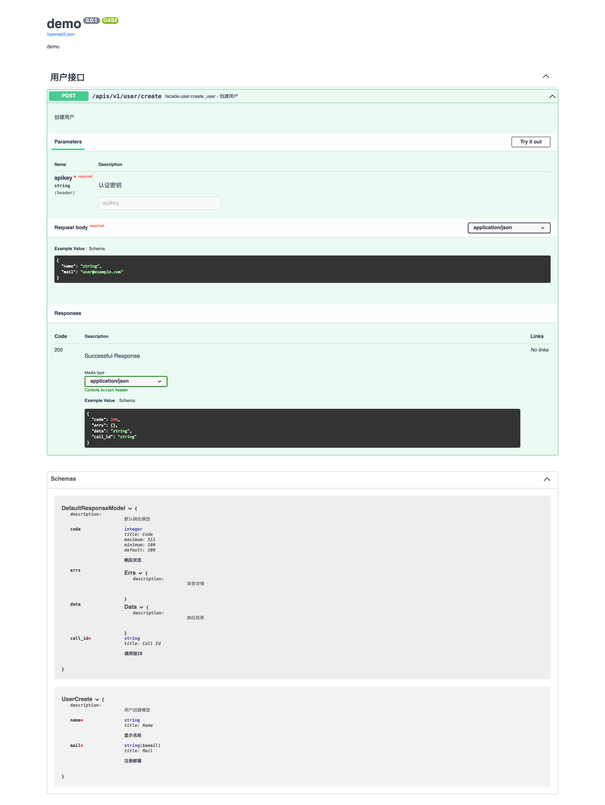

# 运行环境

|system |python | 
|:------|:------|      
|cross platform |3.9.16|

# 组件安装

```shell
pip install -U service-webserver 
```

# 服务配置

> config.yaml

```yaml
WEBSERVER:
  middlewares:
    - service_webserver.core.middlewares.openapi3:OpenApi3Middleware
```

# 入门案例

```
├── facade.py
├── config.yaml
└── project
    ├── __init__.py
    ├── service.py
    ├── models
    |   ├── __init__.py
    |   └── user.py
    ├── schema
    |   ├── __init__.py
    |   └── user.py
    └── router
        ├── __init__.py
        └── user.py
```

> project/schema/user.py

```python
#! -*- coding: utf-8 -*-
#
# author: forcemain@163.com

from __future__ import annotations

import typing as t

from pydantic import Field
from pydantic import EmailStr
from pydantic import BaseModel


class UserCreate(BaseModel):
    """ 用户创建模型 """

    name: t.Text = Field(alias='name', description='显示名称')
    mail: EmailStr = Field(alias='mail', description='注册邮箱')
```

> project/router/user.py

```python
#! -*- coding: utf-8 -*-
#
# author: forcemain@163.com

from __future__ import annotations

import typing as t

from pydantic import Required
from logging import getLogger
from project.service import Service
from project.schema.user import UserCreate
from service_core.core.as_router import ApiRouter
from service_webserver.core.request import Request
from service_webserver.core.entrypoints import webserver
from service_webserver.core.openapi3.generate.depent import params

router = ApiRouter(__name__)
logger = getLogger(__name__)

@router()
@webserver.api('/apis/v1/user/create', methods=['POST'], tags=['用户接口'])
def create_user(
        self: Service, request: Request,
        apikey: t.Text = params.Header(Required, description='认证密钥'),
        body: UserCreate = params.Body(Required, description='请求内容')
) -> None:
    """ 创建用户 """
    data = request.json or {}
    UserCreate(**data).dict()
```

> project/service.py
```python
#! -*- coding: utf-8 -*-
#
# author: forcemain@163.com

from __future__ import annotations

from logging import getLogger
from service_core.core.service import Service as BaseService

logger = getLogger(__name__)


class Service(BaseService):
    """ 微服务类 """

    # 微服务名称
    name = 'demo'
    # 微服务简介
    desc = 'demo'
```

> facade.py
```python
#! -*- coding: utf-8 -*-
#
# author: forcemain@163.com

from __future__ import annotations

from project.router import user
from project.service import Service
from service_core.core.as_router import ApiRouter


router = ApiRouter(__name__)
router.include_router(user.router)

service = Service()
service.include_router(router)
```

# 运行服务

> service start facade --debug

# openapi




# 远程调试

> service debug --port <port>
